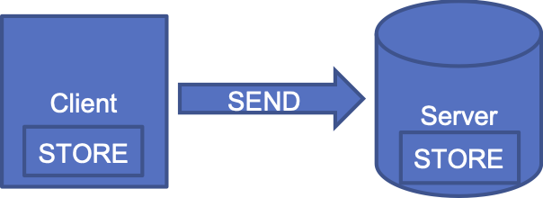

This section outlines important definitions and interpretations and requirements common to all  actors used in this guide.
The conformance verbs used are defined in [FHIR Conformance Rules].


### General

TBD

### Cardinality and MustSupport Definitions

|  | MustSupport | Cardinality | Query Scenario <br> (Server) | Query Scenario <br> (Client)  | Create / Update Scenario <br> (Client)  | Create / Update Scenario <br> (Server)  |
|---|---|---|---|---|---|---|
| A | No | 0..1, 0..* | MAY send/relay data corresponding to this element (not required) <br> <br> SHOULD NOT send element if the data is not available (not collected or null value) | SHOULD NOT assume this element will be received <sup>1, 2</sup> | MAY send/relay data corresponding to this element (not required) <br> <br> SHOULD NOT send element if the data is not available (not collected or null value) | MAY ignore data received in the element <sup>1</sup>
| B | No | 1..1, 1..* | SHALL send/relay the data element populated with a value <br> <br> MAY use a fixed value or rule to populate element with an appropriate value | SHOULD assume this element will be received and may be a fixed value <sup>1, 2</sup> | SHALL send/relay the data element populated with a value <br> <br> MAY use a fixed value or rule to populate element with an appropriate value | MAY ignore data received in the element <sup>1</sup>
| C | Yes | 0..1, 0..* | SHALL send/relay the data element populated with a value (if available) <br> <br> SHOULD NOT send element if the value is null |  SHOULD assume this element will be received if data is available <sup>1, 2</sup> <br> <br> SHOULD assume that a missing data element in response means that a value for that data element was not available<sup>1, 2</sup> | SHALL be capable of sending/relaying the data element to the server <br> <br> SHOULD NOT send element if the value is null | SHALL be capable of receiving/relaying/storing the data for this element <sup>1</sup>
| D | Yes | 1..1, 1..* | SHALL send/relay the data element populated with a value | SHOULD assume a value for this data element will be received <sup>1, 2</sup> | SHALL send/relay the data element populated with a value to the server | SHALL be capable of receiving/relaying/storing the data for this element <sup>1</sup>

<sup>1</sup> Business rules, data regulations, additional implementation guides should determine what the server will do with the data it receives (i.e. store, persist, etc.)

<sup>2</sup> Scope of the CA Baseline Profiles does not include prescriptive constraints on what a Querying Client has to do with the data it receives (i.e. ignore, display, store, persist, etc.).*

**Client = Requestor, Server = Responder**

#### Conformance Language:

| Verb | Definition |
|---|---|
| **SHALL** | an absolute requirement for all implementations |
| **SHALL NOT** | an absolute prohibition against inclusion for all implementations |
| **SHOULD / SHOULD NOT** | A best practice or recommendation to be considered by implementers within the context of their particular implementation; there may be valid reasons to ignore an item, but the full implications must be understood and carefully weighed before choosing a different course |
| **MAY** | This is truly optional language for an implementation; can be included or omitted as the implementer decides with no implications |

#### Examples

##### Line C: Patient.birthDate - MustSupport = Yes, Cardinality = 0..1

###### Query Scenario

<br>

<br>

**Requirement:**

The Server SHALL be able to return a BirthDate if it is known.  (i.e. It must be stored on the server or retrievable in some way.)

(The BirthDate MAY be unknown and therefore not available to send.)

**Process:**

1. Client sends GET request to Server for a Patient (their demographics); included in the request is a query parameter (e.g. Patient’s HCN), so the Server knows which Patient’s info to return
1. Server provides a response which includes the requested Patient’s information
  1. IF the Server has a Birth Date for the Patient, it MUST be included in the response
  1. IF the Patient’s Birth Date is not found on the Server, the Server SHOULD NOT send a null-value Birth Date and instead should remove the Birth Date element entirely from the response
1. Client receives the response from the Server which includes the requested Patient’s information, which includes the Patient’s Birth Date (unless 3b is true)
1. More prescriptive instructions on what exactly the Client needs to be able to DO with the Birth Date element it receives from the Server may be provided in additional, project-specific requirements, but these fall outside the scope of the Must Support flag

###### Create / Update Scenario
<br>

<br>

**Requirement:**

The Client SHALL be able to send a BirthDate if it is known.  (i.e. It must be stored on the client or retrievable in some way.)

The Server SHALL be able to store a BirthDate if it is provided.  (i.e. It must be stored on the server or somewhere where it can be retrieved later.)

(The BirthDate MAY be unknown and therefore not available to send.)


**Process:**

1. Client performs SUBMIT function, and sends a Patient’s information to the Server
  1. IF the Client has a Birth Date for the Patient, it MUST be included in the sent information
  1. IF the Client doesn’t know a Birth Date for the Patient, the Client SHOULD NOT send a null-value Birth Date and instead should remove the Birth Date element entirely from the resource that is being pushed to the server
1. Server MUST have the capacity to receive / support the Birth Date element once it is received from the Client
1. More prescriptive instructions on what exactly the Server needs to be able to DO with the Birth Date element it receives from the Client may be provided in additional, project-specific requirement, but these fall outside the scope of the Must Support flag


| !! Note: Content from here is from US Core ... placeholder only** !! |
|---------|


### Referencing  profiles

Profiles in this guide [reference]({{site.data.fhir.path}}references.html) other FHIR resources that are also profiles.  This is defined in the formal profile definitions.  For any other references not formally defined in a profiles, the referenced resource SHOULD be a profile if a profile exists for the resource type.  ***add examples***

### Using Codes in  profiles

#### Extensible binding for CodeableConcept Datatype

Extensible binding to a value set definition for this IG means that if the data type is CodeableConcept, then one of the coding values SHALL be from the specified value set if a code applies, but if no suitable code exists in the value set and no further restrictions have been applied (such as the max valueset binding described in the next section), alternate code(s) may be provided in its place. If only text available, then just text may be used.

#### Extensible + Max-ValueSet binding for CodeableConcept Datatype
{:.no_toc}

For this IG, we have defined the Extensible + Max-ValueSet binding to allow for either a code from the defined value set or text if the code is not available.  (for example, legacy data). This means, unlike a FHIR extensible binding, alternate code(s) are not permitted and a text value SHALL be supplied if the code is not available.  However, multiple codings (translations) are allowed as is discussed below.

Example: Immunization resource vaccineCode's CVX coding - the source only has the text "4-way Influenza" and no CVX code.

    \{
      "resourceType": "Immunization",
      ...
      "vaccineCode": {
        "text":"4-way Influenza"
      },
      ...
    }


#### Required binding for Code Datatype

Required binding to a value set definition for this IG means that one of the codes from the specified value set SHALL be used. If only text is available or the local (proprietary, system) code cannot be mapped to one of the required codes the [core specification] provides guidance which we have summarized:

1.  Send the resource with the code element empty
2.  Use the [DataAbsentReason Extension] in the data type
3.  Use the code ‘unsupported’ - The source system wasn't capable of supporting this element.

Note that when a query uses a status parameter, a status will be ambiguous.

Example: AllergyIntolerance resource with a status that is text only or cannot be mapped to the status value set.

     \{
       "resourceType”:“AllergyIntolerance”,
       ...
       “\_status”:{
        “url” : “{{site.data.fhir.path}}StructureDefinition/data-absent-reason”,
       “valueCode” : “unsupported”
        ...
      },
     }

#### Required binding for CodeableConcept Datatype

Required binding to a value set definition means that one of the codes from the specified value set SHALL be used and using only text is not valid. In this IG, we have defined the Extensible + Max-ValueSet binding to allow for either a code from the specified value set or text. Multiple codings (translations) are permitted as is discussed below.


#### Using multiple codes with CodeableConcept Datatype

Alternate codes may be provided in addition to the standard codes defined in required or extensible value sets. The alternate codes are called “translations”. These translations may be equivalent to or narrower in meaning to the standard concept code.

Example of multiple translation for Body Weight concept code.


    "code": {
        "coding": [
         {
            "system": "http://loinc.org",  //NOTE:this is the standard concept defined in the value set//
            "code": "29463-7",
            "display": "Body Weight"
          },
    //NOTE:this is a translation to a more specific concept
         {
            "system": "http://loinc.org",
            "code": "3141-9",
            "display": "Body Weight Measured"
          },
    //NOTE:this is a translation to a different code system (Snomed CT)
         {
            "system": "http://snomed.info/sct",
            "code":  “364589006”,
            "display": "Body Weight"
          }
    //NOTE:this is a translation to a locally defined code
         {
            "system": "http://AcmeHealthCare.org",
            "code":  “BWT”,
            "display": "Body Weight"
          }
        ],
        "text": "weight"
      },

Example of translation of CVX vaccine code to NDC code.


    "vaccineCode" : {
        "coding" : [
          {
            "system" : "{{site.data.fhir.path}}sid/cvx",
            "code" : "158",
            "display" : "influenza, injectable, quadrivalent"
          },
          {
            "system" : "{{site.data.fhir.path}}sid/ndc",
            "code" : "49281-0623-78",
            "display" : "FLUZONE QUADRIVALENT"
          }
        ]
      },

####  Using UCUM codes in the [Quantity] datatype

Both the [Vital Signs Profile] and [ Result Observation Profile] bind the `valueQuantity` datatypes to the [UCUM] code system.  A FHIR [UCUM Codes value set] that defines all UCUM codes is in the FHIR specification. This guidance specifies how to represent the Quantity datatype when the correct UCUM units are missing or the units are missing altogether which will likely occur in the real world.  

**UCUM code provided**

```
 "valueQuantity": {
    "value": 26.0,
    "unit": "g/mL",
   "system": "http://unitsofmeasure.org",
   "code": "g/mL"
  }
```

**free text units only**:
- If UCUM units are not available then represent units in the `unit` element.

```
 "valueQuantity": {
    "value": 26.0,
    "unit": "RR",
     }
```

**no units**

```
 "valueQuantity": {
    "value": 26.0
 }
```

### Representing Deleted Information

Clinical information that has been removed from the patient's record needs to be represented in a way so that client systems know they can delete them.

- A FHIR server SHOULD not delete resources.

- The resource status SHOULD be updated to the appropriate status such as  `entered-in-error` or `inactive`, and these resources SHOULD *still* be searchable by client applications.

- If the status is `entered-in-error`:

  - for patient viewing systems the content of resource SHOULD be removed. In other words a blank resource.

  - A provider facing system MAY be supplied with additional details that the patient viewing system would typically not have access to.

### Read(Fetch) resource notation:

Interactions on profile pages are defined with the syntax:

 **`GET [base]/[Resource-type]/[id] {parameters}`**

-   GET is the HTTP verb used for fetching a resource
-   Content surrounded by \[\] is mandatory, and will be replaced by the string literal identified.
    -   base: The Service Root URL (e.g. “<https://fhir-open-api-dstu2.smarthealthit.org>”)
    -   Resource-type: The name of a resource type (e.g. “Patient”)
    -   id: The Logical Id of a resource(e.g. “24342”)
-   Content surrounded by {} is optional
    -   parameters: URL parameters as defined for the particular interaction (e.g."?\_format=xml"}

For more information see the [FHIR RESTful API]

### Search Syntax

In the simplest case, a search is executed by performing a GET operation in the RESTful framework:

**GET [base]/[Resource-type]?name=value&...**

For this RESTful search ([FHIR Search]), the parameters are a series of name=\[value\] pairs encoded in the URL. The search parameter names are defined for each resource. For example, the Observation resource the name “code” for search on the LOINC code. See [FHIR Search] for more information about searching in REST, messaging, and services.

### Syntax for searches limited by patient

There are several potential ways to search for resources associated with a specific patient depending on the context and implementation. These searches result in the same outcome.:

1. An explicitly defined patient using the 'patient' parameter that controls which set of resources are being searched by resource type.  Note that all the search interactions in this IG are published using this syntax:
  - **GET [base]/[Resource-type]?patient=24342{&otherparameters}**
   - There are several variations to this syntax which are listed below:

        -   GET \[base\]/\[Resource-type\]?Subject=\[id\]{&other parameters}
        -   GET \[base\]/\[Resource-type\]?Subject=Patient/\[id\]{&other parameters}
        -   GET \[base\]/\[Resource-type\]?Subject.\_id=\[id\]{&other parameters}
        -   GET \[base\]/\[Resource-type\]?subject:Patient=\[id\]{&other parameters}
        -   GET \[base\]/\[Resource-type\]?subject:Patient=Patient/\[id\]{&other parameters}
        -   GET \[base\]/\[Resource-type\]?subject:Patient=\[https://%5Burl%5D/Patient/id\]{&other parameters}
        -   GET \[base\]/\[Resource-type\]?subject:Patient.\_id=\[id\]{&other parameters}
        -   GET \[base\]/\[Resource-type\]?patient:Patient=\[https://%5Burl%5D/Patient/id\]{&other parameter

1. The patient may be *implicit* in the context (e.g. using SMART). Then the patient parameter can be omitted:
  - **GET [base]/[Resource-type]{?other-parameters}**

1. Patient [compartment] based search with a specified resource type in that compartment. **NOTE this IG does not support compartment based searches**.

### Across Platform Searches

 servers are not required to resolve full URLs that are external to their environment.

### Guidance on limiting the number of search results

In order to manage the number of search results returned, the server may choose to return the results in a series of pages. The search result set contains the URLs that the client uses to request additional pages from the search set. For a simple RESTful search, the page links are contained in the returned bundle as links. See the [managing returned resources] in the FHIR specification for more information.
